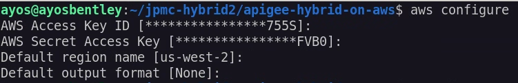
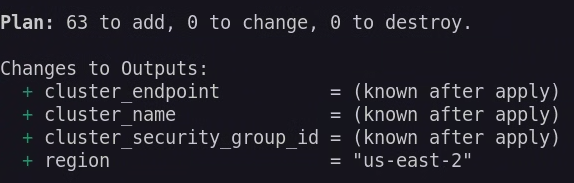

## Disclaimer
This tool is open-source software. It is not an officially supported Google product. It is not a part of Apigee, or any other officially supported Google Product.


## How to Setup Apigee hybrid on AWS EKS Clusters using Terraform 


The terraform configuration defines a new VPC in which to provision the cluster, and uses the public EKS module to create the required resources, including Auto Scaling Groups, security groups, and IAM Roles and Policies.
Open the main.tf file to review the module configuration. The eks_managed_node_groups parameter configures the cluster with three nodes across two node groups.  


## Getting Started

Setup an AWS Account if you dont have one as described [here](https://aws.amazon.com/free/?gclid=Cj0KCQiA4fi7BhC5ARIsAEV1YibM5aQfcEpKMPjPwUGl-JqNl6fp9-LoTxpHhH2RFh59MFc1_yETcCQaAmHGEALw_wcB&trk=c8882cbf-4c23-4e67-b098-09697e14ffd9&sc_channel=ps&ef_id=Cj0KCQiA4fi7BhC5ARIsAEV1YibM5aQfcEpKMPjPwUGl-JqNl6fp9-LoTxpHhH2RFh59MFc1_yETcCQaAmHGEALw_wcB:G:s&s_kwcid=AL!4422!3!453053794281!e!!g!!create%20aws%20account!10706954804!104359293503&all-free-tier.sort-by=item.additionalFields.SortRank&all-free-tier.sort-order=asc&awsf.Free%20Tier%20Types=*all&awsf.Free%20Tier%20Categories=*all)  
Create an IAM user and a cli user described [here](https://docs.aws.amazon.com/IAM/latest/UserGuide/id_users_create.html) ( we would use the cli user credentials when configuring our aws cli)  
Download and install terraform to your local terminal described [here](https://developer.hashicorp.com/terraform/install)  
Download and install the awscli to your local terminal from where terraform would be run described [here](https://docs.aws.amazon.com/cli/v1/userguide/cli-chap-install.html)  
Download and install helm  ( version 3.16.2+)  
Run terraform init to initialise terraform  


## Pre-Cluster Setup Steps  
 
1. Run aws configure - Run aws configure command to configure settings that the AWS Command Line Interface (AWS CLI) uses to interact with AWS. The credentials and config file are created/updated when you run the command aws configure. The credentials file is located at ~/.aws/credentials on Linux or macOS,  or at C:\Users\USERNAME\.aws\credentials on Windows.  
   Output should be similar to below  
   
   
2. **Authenticate with GCP**:
    *   Ensure you have the Google Cloud SDK (gcloud) installed and configured.
    *   Ensure that Organization Policy is not disabled to create service account and associated Service Account Key.
    *   Ensure that the user performing terraform has the permissions to access Google Cloud resources. While not recommended but roles like `roles/editor` or `roles/owner` should ensure all tasks completes successfully.
    *   Follow the instructions in the Apigee Hybrid documentation to authenticate with GCP using `gcloud auth application-default login` and set the `GOOGLE_APPLICATION_CREDENTIALS` environment variable.
    *   Optional: Set the `gcloud config set project <your-gcp-project-id>`

3.  **Customize the Terraform configuration files**:
    *   Review `main.tf` (and any module files) to adjust your worker nodes and labels.
    *   Update `terraform.tfvars` file (or create one, e.g., `terraform.tfvars`) with your specific values (e.g., eks region and Apigee Organization etc).
    *   Set `create_org=true` if you want the script to create Apigee organization for you.
    *   Set `apigee_install=true` if you want the script to install Apigee Hybrid for you.

4.  **Run `terraform plan`**:
    Validate the list of Azure resources to be created. The exact count will vary based on your configuration. Review the plan carefully to ensure it matches your expectations.
      

5.  **Run `terraform apply`**:
    This will provision the AWS resources and create the EKS cluster. Confirm the apply when prompted. This process can take several minutes.

## What Happens During Apply

When you run `terraform apply`, the following sequence of events occurs:

1. **AWS Infrastructure Setup**:
   - Creates a new VPC with public and private subnets across two availability zones
   - Sets up NAT Gateway for private subnet internet access
   - Configures security groups and IAM roles
   - Creates an EKS cluster with managed node groups:
     - `apigee-runtime` node group with 2 t3.xlarge instances
     - `apigee-data` node group with 1 t3.xlarge instance
   - Installs the AWS EBS CSI driver for persistent storage

2. **GCP/Apigee Setup** (if `create_org=true`):
   - Enables required Google Cloud APIs (Apigee, IAM, Compute, etc.)
   - Creates an Apigee organization in your GCP project
   - Sets up an Apigee environment (e.g., "dev")
   - Creates an environment group with specified hostnames
   - Attaches the environment to the environment group

3. **Service Account and Certificate Setup**:
   - Creates a GCP service account for Apigee Hybrid
   - Generates a service account key
   - Creates self-signed TLS certificates for the environment group hostnames
   - Saves all credentials and certificates to the `output/<project-id>` directory

4. **Apigee Hybrid Installation** (if `apigee_install=true`):
   - Creates the Apigee namespace in the EKS cluster
   - Enables control plane access for the service account
   - Installs required Kubernetes components:
     - Custom Resource Definitions (CRDs)
     - cert-manager
     - Apigee operator
   - Deploys Apigee components in sequence:
     - Datastore (Cassandra)
     - Telemetry
     - Redis
     - Ingress Manager
     - Organization
     - Environment
     - Environment Group
   - Sets up the ingress gateway with the specified configuration

The entire process typically takes 15-30 minutes to complete, depending on your network speed and the size of the cluster.

## Accessing the Cluster

The terraform configuration automatically configures your local kubectl context to connect to the newly created EKS cluster. You can verify your access by running:

```bash
kubectl get pods -A
```

If you need to manually configure kubectl access to the cluster, you can use the following command:

```bash
aws eks --region $(terraform output -raw region) update-kubeconfig \
    --name $(terraform output -raw cluster_name)
```

## Multiple clusters  

To create multiple clusters perform the following steps  

Clone the repo to another folder (or copy existing and delete terraform state files and folder)

Now repeat from steps 3 above  


## Clean Up  

To perform a clean up of the aws resources created by terraform

Step 1. Delete the aws loadbalancers created ( these get created when the ingress is created and also another one when the kubernetes service in part 3 is created). Alternative to this step would be to import the loadbalancers created manually with terraform import so terraform can manage the destruction of these going forward.  

Step 2. Run terraform destroy to delete the aws resources created by terraform  
