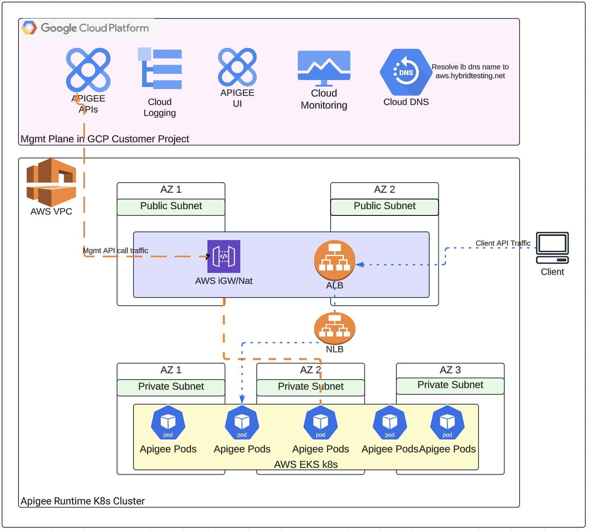

## Disclaimer
This tool is open-source software. It is not an officially supported Google product. It is not a part of Apigee, or any other officially supported Google Product.


## How to Setup Apigee hybrid on AWS EKS Clusters using Terraform 


The terraform configuration defines a new VPC in which to provision the cluster, and uses the public EKS module to create the required resources, including Auto Scaling Groups, security groups, and IAM Roles and Policies.
Open the main.tf file to review the module configuration. The eks_managed_node_groups parameter configures the cluster with three nodes across two node groups.  


## Getting Started

Setup an AWS Account if you dont have one as described [here](https://aws.amazon.com/free/?gclid=Cj0KCQiA4fi7BhC5ARIsAEV1YibM5aQfcEpKMPjPwUGl-JqNl6fp9-LoTxpHhH2RFh59MFc1_yETcCQaAmHGEALw_wcB&trk=c8882cbf-4c23-4e67-b098-09697e14ffd9&sc_channel=ps&ef_id=Cj0KCQiA4fi7BhC5ARIsAEV1YibM5aQfcEpKMPjPwUGl-JqNl6fp9-LoTxpHhH2RFh59MFc1_yETcCQaAmHGEALw_wcB:G:s&s_kwcid=AL!4422!3!453053794281!e!!g!!create%20aws%20account!10706954804!104359293503&all-free-tier.sort-by=item.additionalFields.SortRank&all-free-tier.sort-order=asc&awsf.Free%20Tier%20Types=*all&awsf.Free%20Tier%20Categories=*all)  
Create an IAM user and a cli user described [here](https://docs.aws.amazon.com/IAM/latest/UserGuide/id_users_create.html) ( we would use the cli user credentials when configuring our aws cli)  
Download and install terraform to your local terminal described [here](https://developer.hashicorp.com/terraform/install)  
Download and install the awscli to your local terminal from where terraform would be run described [here](https://docs.aws.amazon.com/cli/v1/userguide/cli-chap-install.html)  
Download and install helm  ( version 3.16.2+)  
Run terraform init to initialise terraform  


## Pre-Cluster Setup Steps  

1. Perform steps 1,2 and 3 in part 1 of the Apigee Hybrid setup to create your APigee organization, environment and environment group described [here](https://cloud.google.com/apigee/docs/hybrid/v1.12/precog-overview)  
2. Run aws configure - Run aws configure command to configure settings that the AWS Command Line Interface (AWS CLI) uses to interact with AWS. The credentials and config file are created/updated when you run the command aws configure. The credentials file is located at ~/.aws/credentials on Linux or macOS,  or at C:\Users\USERNAME\.aws\credentials on Windows.  
   Output should be similar to below  
   
   
3. Customise the terraform configuration files  
   3a. main.tf with your worker nodes and labels  
   3b. Customise terraform.tf  
   
4. Run Terraform plan - and validate the list of resources to be created, there should be a count of 63 resources to be created in AWS. Output should be similar to below  

     

   
5. Run terraform apply to have the 63 resources created in AWS and eks cluster comes up 

## Accessing the Cluster  
Once the cluster is up run the below command to gain access to the cluster  

```
aws eks --region $(terraform output -raw region) update-kubeconfig \
    --name $(terraform output -raw cluster_name)
```

Now you can run```kubectl get pods -A```
 to confirm the system pods have been created before you proceed.  
 

## Apigee Hybrid Installation steps  

Now proceed with part 2 of the setup steps to install Apigee hybrid described [here](https://cloud.google.com/apigee/docs/hybrid/v1.12/install-download-charts)   

At the end of the steps to install Apigee hybrid along with the helm charts, the Apigee Runtime components would be created in the AWS EKS cluster as shown below  




## Multiple clusters  

To create multiple clusters perform the following steps  

Clone the repo to another folder (or copy existing and delete terraform state files and folder)

Now repeat from steps 3 above  


## Clean Up  

To perform a clean up of the aws resources created by terraform

Step 1. Delete the aws loadbalancers created ( these get created when the ingress is created and also another one when the kubernetes service in part 3 is created). Alternative to this step would be to import the loadbalancers created manually with terraform import so terraform can manage the destruction of these going forward.  

Step 2. Run terraform destroy to delete the aws resources created by terraform  
