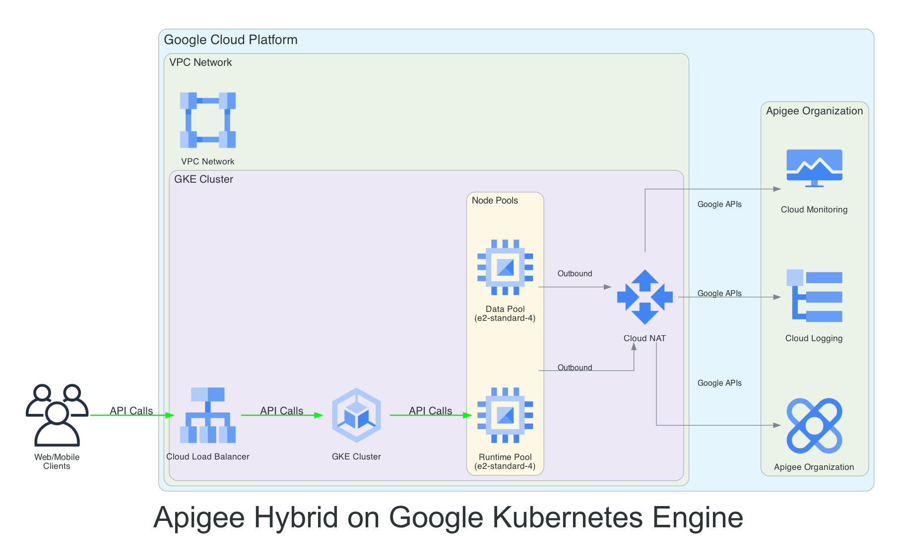

## Disclaimer
This tool is open-source software. It is not an officially supported Google product. It is not a part of Apigee, or any other officially supported Google Product.

## Architecture

The following diagram illustrates the architecture of Apigee Hybrid on Google Kubernetes Engine (GKE):



The architecture consists of:

1. **Client Layer**:
   - Web/Mobile clients making API calls to the GKE cluster

2. **Google Cloud Infrastructure**:
   - Cloud Load Balancer for distributing incoming traffic
   - GKE Cluster with:
     - Runtime Pool for Apigee runtime components
     - Data Pool for Apigee data components
   - Cloud NAT for outbound connectivity
   - VPC Network with appropriate subnets

3. **Apigee Management Plane**:
   - Apigee Organization for API management
   - Cloud Logging for log collection
   - Cloud Monitoring for metrics and observability

## How to Setup Apigee Hybrid on GKE Clusters using Terraform

The Terraform configuration defines a new VPC network in which to provision the Google Kubernetes Engine (GKE) cluster. It uses the `google` provider to create the required GCP resources, including the GKE cluster, node pools (with auto-scaling capabilities), VPC firewall rules, and necessary IAM configurations.

Open the `main.tf` file to review the resource configuration. The `google_container_cluster` resource configures the cluster, including a default system node pool. Additional user node pools can be defined using `google_container_node_pool` resources, for example, to have different machine types or capabilities for specific workloads (like Apigee runtime components).

Once the terraform provisions the GKE infrastructure, it proceeds to create Apigee Organization, Environment and Environment Group and installs Apigee Hybrid.

## Getting Started

1. **Setup a Google Cloud Project** if you don't have one. You can create one in the [Google Cloud Console](https://console.cloud.google.com/).

2. **Configure Google Cloud Authentication**:
   * Ensure you have the Google Cloud SDK (gcloud) installed and configured
   * Run `gcloud auth application-default login` to authenticate
   * Set your project: `gcloud config set project <your-project-id>`
   * Ensure that Organization Policy is not disabled to create service account and associated Service Account Key
   * Ensure that the user performing terraform has the permissions to access Google Cloud resources. While not recommended but roles like `roles/editor` or `roles/owner` should ensure all tasks completes successfully

3. **Download and install Terraform** to your local terminal as described [here](https://developer.hashicorp.com/terraform/install).

4. **Download and install Helm** (version 3.10+ recommended, check Apigee docs for specific version compatibility).

5. Run `terraform init` to initialize Terraform and download necessary providers.

## Pre-Cluster Setup Steps

1. **Customize the Terraform configuration files**:
   * Review `main.tf` and `variables.tf` to adjust GCP resource definitions like VPC network, GKE cluster version, node pool configurations (machine types, count, taints, labels for Apigee workloads)
   * Update `terraform.tfvars` file with your specific values (e.g., GCP region, project ID and other details)
   *   Set `create_org=true` if you want the script to create Apigee organization for you.
   *   Set `apigee_install=true` if you want the script to install Apigee Hybrid for you.
   * Ensure your Terraform configuration outputs key values like `project_id` and `cluster_name` which will be used later

2. **Run `terraform plan`**:
   Validate the list of GCP resources to be created. Review the plan carefully to ensure it matches your expectations.

3. **Run `terraform apply`**:
   This will provision the GCP resources and create the GKE cluster. Confirm the apply when prompted. This process can take several minutes.

## What Happens During Terraform Apply

When you run `terraform apply`, the following resources are created in sequence:

1. **GCP Infrastructure Setup**:
   - Creates a new VPC network with appropriate subnets
   - Sets up Cloud NAT for outbound connectivity
   - Configures firewall rules for the cluster
   - Creates necessary IAM service accounts and roles

2. **GKE Cluster Creation**:
   - Creates the main GKE cluster with a system node pool
   - Configures network plugin and policy
   - Sets up service CIDR and DNS service IP
   - Enables workload identity

3. **Additional Node Pools**:
   - Creates "apigeerun" node pool for Apigee runtime components
   - Creates "apigeedata" node pool for Apigee data components
   - Both pools support auto-scaling if enabled
   - Configures appropriate machine types and disk sizes for each workload

4. **Apigee Setup**:
   - Enables required Google Cloud APIs
   - Creates a service account for Apigee with necessary IAM roles
   - Generates and saves service account key
   - Creates self-signed TLS certificates for Apigee environment group
   - Generates Apigee overrides.yaml configuration file from the provided template file with mapped variables
   - Sets up Apigee organization, environment, and environment group
   - Creates a directory output/${PROJECT_ID} to store generated certificates, keys, overrides.yaml and apigee-service.yaml

5. **Final Configuration**:
   - Configures kubectl to connect to the new GKE cluster
   - Installs Apigee Hybrid (using Helm) by calling setup_apigee.sh script
   - Outputs important information like project ID and kubeconfig

The entire process typically takes 15-30 minutes to complete, depending on the size of your cluster and the number of resources being created.

## Accessing the Cluster

Once the cluster is up, run the following command to configure `kubectl` to connect to your new GKE cluster:

```bash
gcloud container clusters get-credentials $(terraform output -raw cluster_name) \
    --region $(terraform output -raw region) \
    --project $(terraform output -raw project_id)
```

## Cleanup

When you're done with the Apigee hybrid setup and want to remove all created resources, follow these steps:

1. **Remove Apigee Hybrid Components**:
   ```bash
   # Delete Apigee hybrid components from the cluster
   helm uninstall <<apigee-hybrid-components>> -n apigee
   ```

2. **Destroy Terraform Resources**:
   ```bash
   # Remove all GCP resources created by Terraform
   terraform destroy
   ```
   This will remove:
   - The GKE cluster and all node pools
   - VPC network and subnets
   - Cloud NAT and associated resources
   - All other GCP resources created by the Terraform configuration

3. **Clean Up Local Files**:
   ```bash
   # Remove generated certificates and keys
   rm -rf output/${PROJECT_ID}/
   
   # Remove Terraform state files
   rm -f terraform.tfstate*
   ```

4. **Optional: Remove Apigee Resources**:
   
   Terraform destroy should clean this up but in case of failure, you can 
   delete the Apigee resources individually:

   ```bash
   # Delete Apigee environment group
   gcloud apigee envgroups delete ${ENVGROUP_NAME} --organization=${PROJECT_ID}
   
   # Delete Apigee environment
   gcloud apigee environments delete ${ENV_NAME} --organization=${PROJECT_ID}
   
   # Delete Apigee organization (if created)
   gcloud apigee organizations delete ${PROJECT_ID}
   ```

Note: The `terraform destroy` command will prompt for confirmation before proceeding. Make sure you have backups of any important data before running the cleanup commands.
